# Spletno programiranje 2020/2021

Dokumentacija lastnega projekta pri predmetu **Spletno programiranje** v študijskem letu **2020/2021**.

## 1. LP

Osnutek aplikacije in wireframe model

### Podrobnejši opisi zaslonskih mask

Dostopno vsem:

- Domača stran:
  - uvodni tekst za obiskovalce strani.
  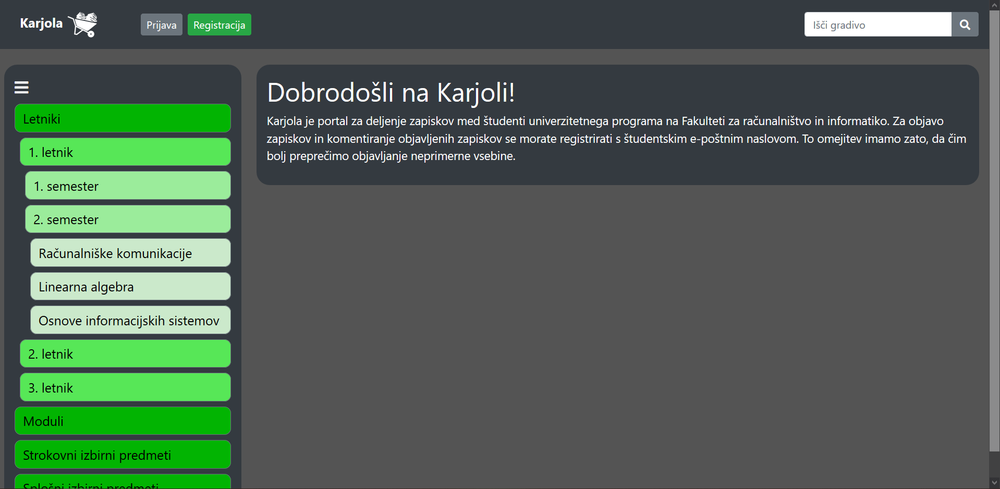
- Profesorji/asistenti (neregistriran uporabnik):
  - opis profesorja/asistenta: akademski naziv, izobrazba, ime in priimek, opis, slika
  - možnost ogleda, ni možnosti urejanja
  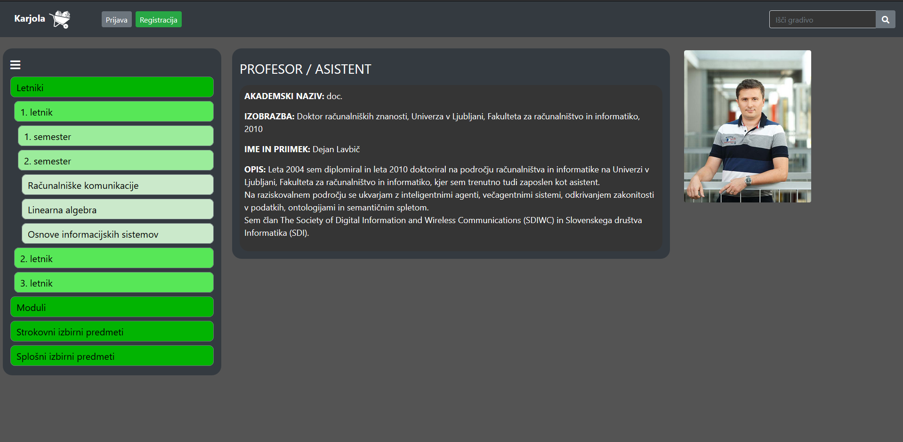
- Splošni pogoji:
	- seznam pravil, splošnih pogojev uporabe spletne strani
	- za podrobnejši opis posamezne kategorije: klik na naslov
  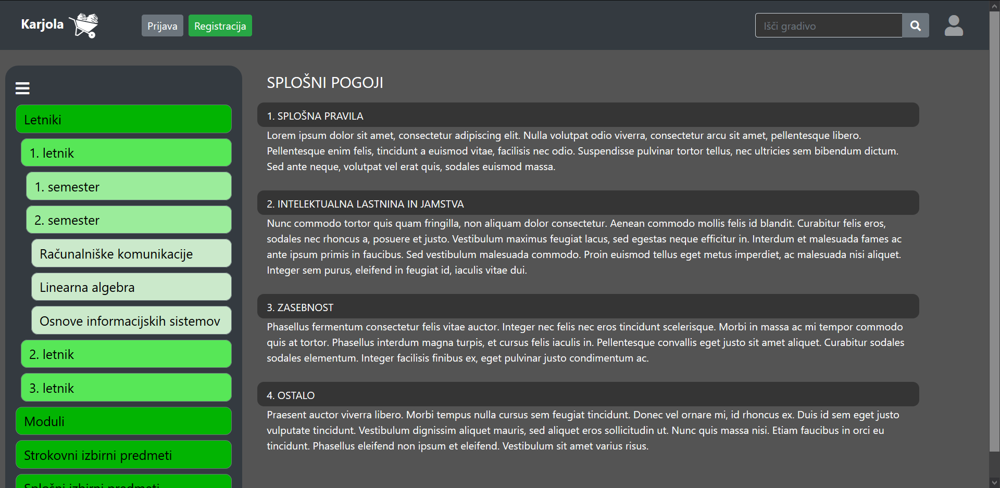
- Registracija:
  - Da se lahko uporabijo napredne funkcije, se je potrebno registrirati na spletno strani. Pri tem izpolnimo zahtevana vnosna polja
  - Odkljukati je potrebno tudi strinjanje s splošnimi pogoji. Če smo vse izpolnili, pritisnemo na gumb "Registriraj se"
  - V primeru napake se izpišejo ustrezna opozorila
  - Polje "Kraj" se izpolni s pomočjo [**zunanje storitve** ][1]. Če je poštna številka pravilna se izpiše ime kraja, sicer prikaže opozorilo
  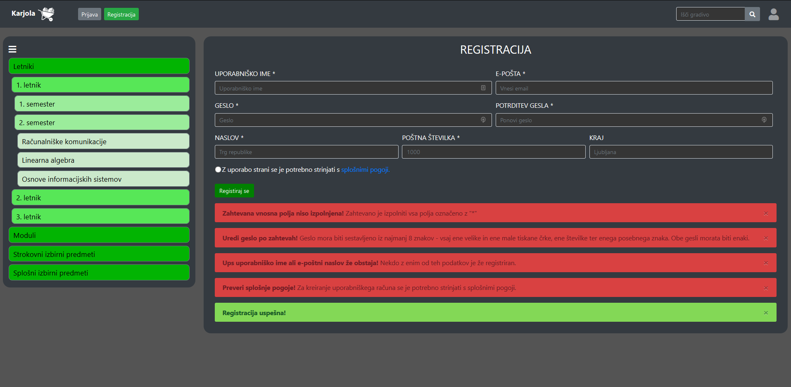
- Prijava:
  - Za prijavo vnesemo e-pošto in geslo, ki smo ga izbrali ob registraciji
  - Lahko izberemo, da ostanemo prijavljeni
  - V primeru napake se izpišejo ustrezna opozorila
  - Prijavimo se s klikom na gumb "Prijavi se"
  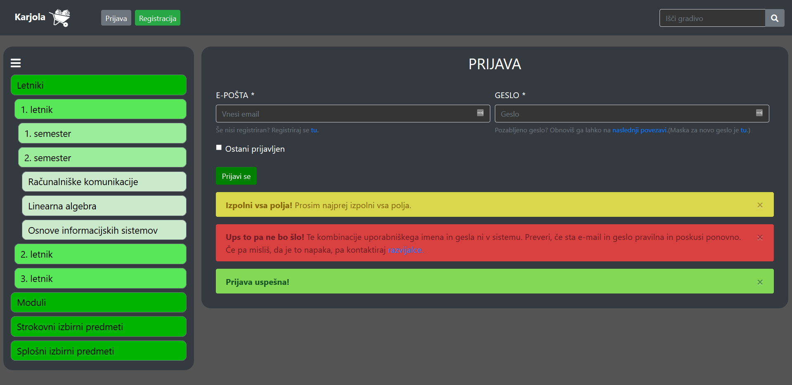
- Ponastavitev gesla:
  - Vnesemo e-mail, ki se nahaja v podatkovni bazi in kliknemo na gumb "Ponastavi geslo". V primeru napak ali nepravilnega vnosa uporabnika spletna stran obvesti.
  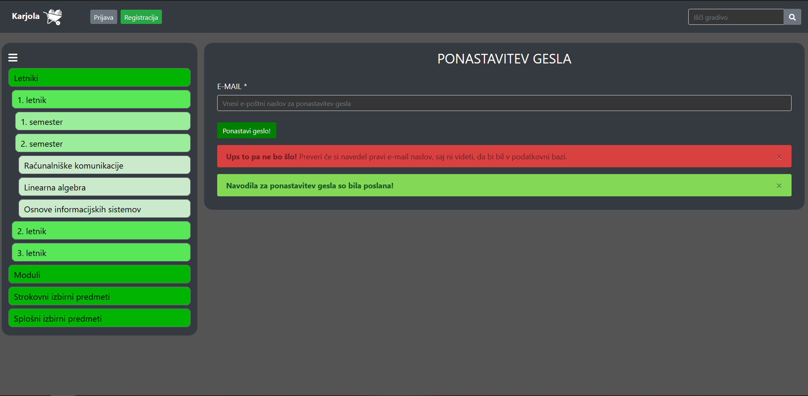
- Vnos novega gesla:
  - V obe polji vnesemo enako novo geslo, ki ustreza kriteriju: Geslo mora biti sestavljeno iz najmanj 10 znakov - vsaj ene velike in ene male tiskane črke, ene številke ter enega posebnega znaka.
  V primeru, da geslo ne ustreza kriterijem, se izpiše ustrezno opozorilo.
  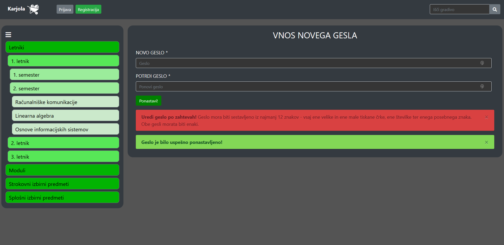
- Rezultati iskanja:
  - tabela gradiva, ki ustreza iskalnemu izrazu
  - tabela predmetov, povezanih z iskanim izrazom
  - tabela profesorjev in asistentov, povezanih z iskalnim izrazom
  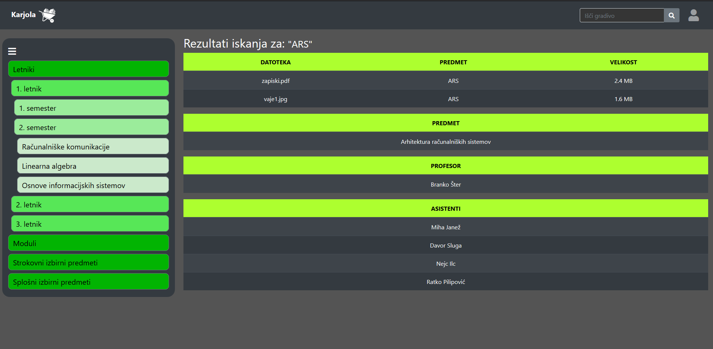
- Stran predmeta:
  - opis predmeta
  - seznam izvajalcev
  - seznam objavljenih dokumentov
    Vsak dokument ima:
    - gumb za prijavo neprimernega dokumenta
    - gumb za prenos datoteke
    - seznam komentarjev
      Vsak komentar ima:
      - uporabniško ime avtorja
      - datum in čas objave
      - vsebina komentarja
      - gumb za prijavo neprimernega komentarja
  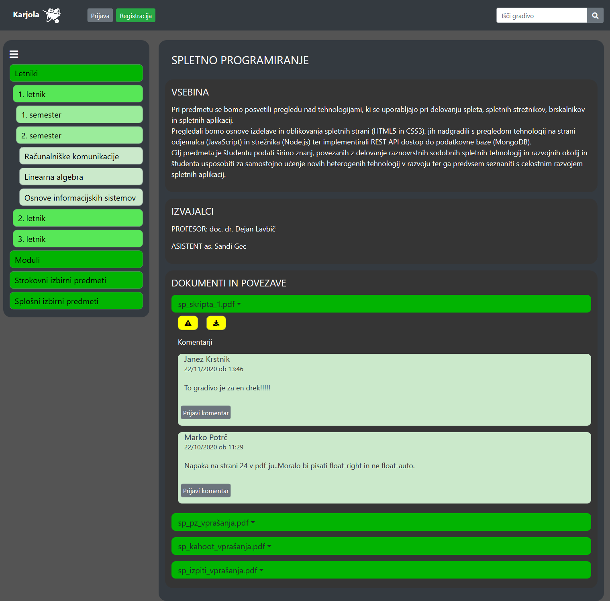

Dostopno prijavljenemu uporabniku:

- Uporabniške nastavitve:
  - vnosno polje in gumb za spremembo uporabniškega imena
  Če je uporabniško ime že zasedeno, se izpiše opozorilo.
  - vnosni polji in gumb za spremembo gesla. Polji za novo geslo in potrditev novega gesla morata vsebovati isto geslo.
  Če geslo ne ustreza kriterijem, ali se gesli ne ujemata, se izpiše opozorilo.

  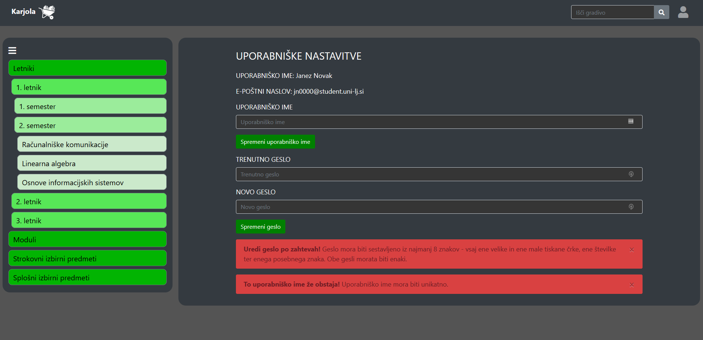
- Stran predmeta (uporabnik):
  Uporabnikova stran predmeta je povsem podobna navadni, ima pa še dodane:
  - polje za vpis komentarja pri vsakem dokumentu:
    - potrditveno polje, če uporabnik želi komentirati anonimno
    - gumb za objavo komentarja
  - polje za vpis URL povezave do gradiva na internetu
  - polje za nalaganje datoteke
  - gumb za objavo povezave oz. datoteke

  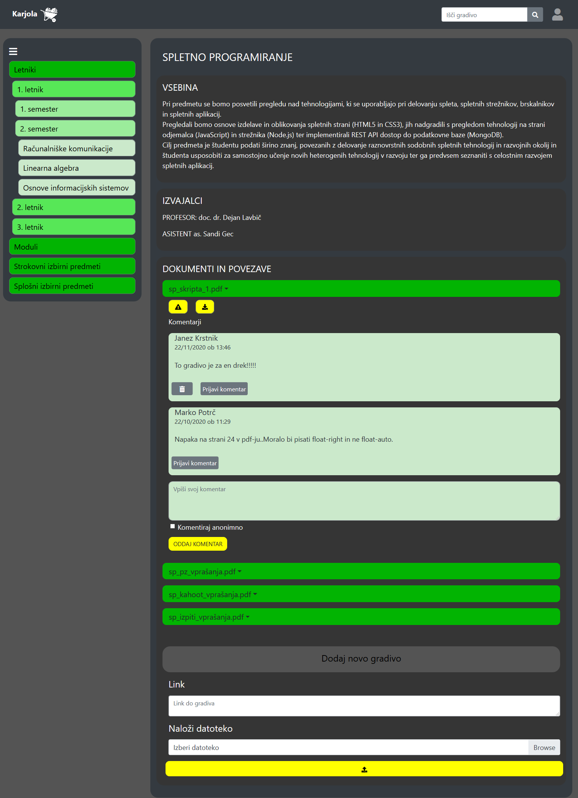

Dostopno adminu:

- Admin management:
  - seznam profesorjev in asistentov
  - seznam predmetov
  - seznam modulov
  - pri vsakem seznamu možnost dodajanja novega elementa (s klikom na gumb 'Dodaj' se odpre obrazec za dodajanje)
  - vsak element seznama je možno urejati/brisati

  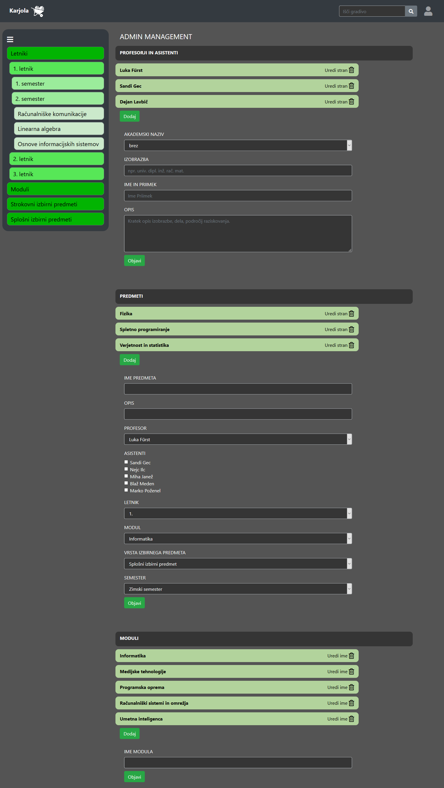
- Profesorji/asistenti (admin):
	- opis profesorja/asistenta: akademski naziv, izobrazba, ime in priimek, opis, slika
	- možnost urejanja vsake kategorije posebej

  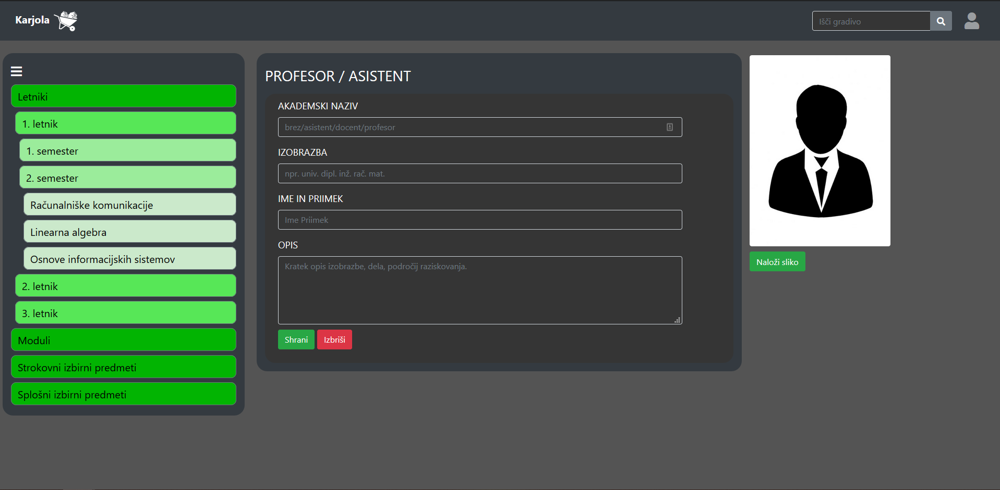
- Stran predmeta (admin):
  Povsem podobno strani predmeta za navadnega uporabnika, z dodanimi gumbi za brisanje datotek in komentarjev, gumbom za skrivanje objavljenega gradiva pred drugimi ter z vidnim številom prijav posameznega dokumenta oz. komentarja.  

  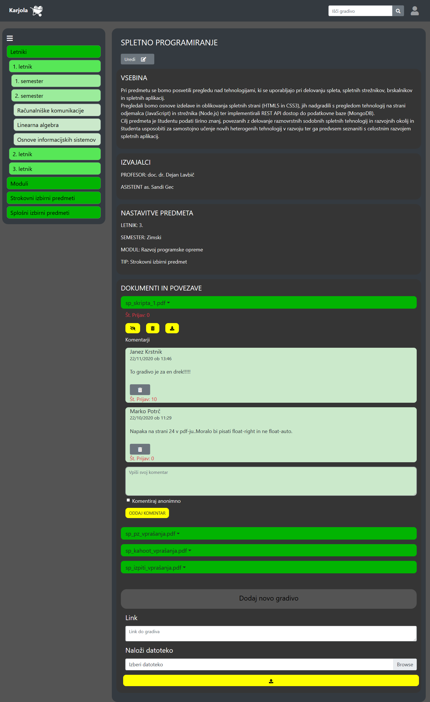
- Stran za urejanje predmeta:
  Obrazec za urejanje posameznega predmeta:
  - polje za ime predmeta
  - polje za nastavitev letnika, v katerem je predmet
  - polje za nastavitev tipa izbirnega predmeta, če je predmet izbirni
  - polje za nastavitev profesorja
  - polje za nastavitev asistentov
  - polje za določitev modulov, v katerih je predmet
  - polje za opis predmeta
  - gumb za shranjevanje predmeta
  - gumb za brisanje predmeta
  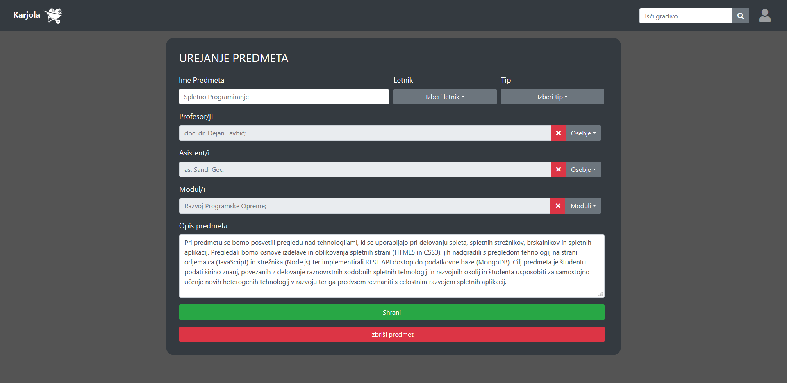

## Testiranje aplikacije na različnih napravah

Aplikacije smo stestirali na virtualnih napravah:
- **iPhone 6/7/8** (na mobilnih napravah smo preverili tako **portrait** kot **landscape** način)
- **iPadu**
- **zaslonu resolucije 1920*1080**

Ugotovitve so naslednje:
- najbolj priporočljiva uporaba aplikacije je na zaslonih resolucije **1920*1080**, in sicer zaradi velikega števila elementov na posameznih straneh, saj je vsebina tako najbolj pregledna
- na mobilnih napravah se vsebina ustrezno prilagaja zaslonu zaradi uporabe Bootstrap komponent
- na iPadu se vsebina ustrezno prilagaja zaslonu zaradi uporabe Bootstrap komponent

## Testiranje aplikacije v različnih brskalnikih
Aplikacije smo stestirali v različnih brskalnikih:
- **Google Chrome**
- **Firefox**
- **Microsoft Edge (Chromium)**

Ugotovitve so naslednje:
- v brskalniku **Google Chrome** se vsebina ustrezno prikaže, vse funkcionalnosti aplikacije delujejo pravilno
- v brskalniku **Firefox** se vsebina ustrezno prikaže, vse funkcionalnosti aplikacije delujejo pravilno
- v brskalniku **Microsoft Edge (Chromium)** se vsebina ustrezno prikaže, vse funkcionalnosti aplikacije delujejo pravilno
- najbolj priporočljiva uporaba aplikacije je v brskalniku **Google Chrome**, saj je bila aplikacija razvita za ta brskalnik

 [1]:https://api.lavbic.net/docs/#/Kraji
